# Frontend Practice #1

This was a quick mockup of a Figma design to get familiar with React, styled components, and the process of using Figma for front-end design.

- Access the Figma design: https://www.figma.com/community/file/1095764931979503418
- View the finished implementation: https://practice-frontend-one.netlify.app 

> **Disclaimer**
> This is not my Figma design. If you would like to use it please contact the original figma designer. This was designed only for practice and is not intended to be used commercially. 

The project uses Vite as a development server. To demo it, run the following terminal commands:

- `npm install`
- `npm run start`

You can then visit the app in-browser; it defaults to http://localhost:3000.

_Note that this project was only focused on a quick sketch up of a figma design and not a working app._ Many parts of the website don't do anything.

Stack used:

- Typescript
- Figma
- Vite
- React V18
- React Router
- Redux
- Recharts
- Styled Components

Several design choices were ignored for the sake of accessibility (e.g. minimum font size was bumped up to 16px) or aesthetics.  
There is also currently a bug with recharts and react v18 on window resize and a window refresh may be required when changing window dimensions.  
[Related Recharts issue #2813](https://github.com/recharts/recharts/issues/2813)

## Part One: Desktop Dashboard / Login

| Figma Design                                                                    | React Implementation                                                              |
| ------------------------------------------------------------------------------- | --------------------------------------------------------------------------------- |
| 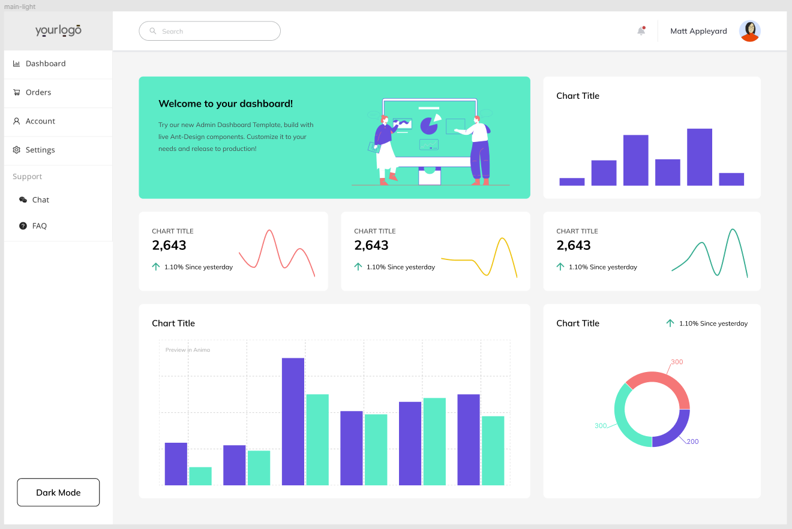 | 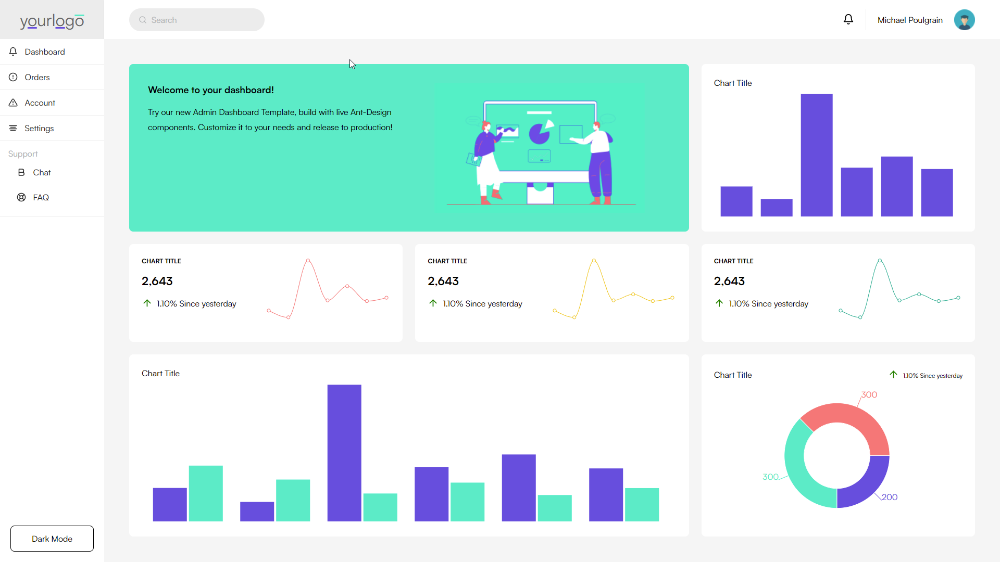 |
| 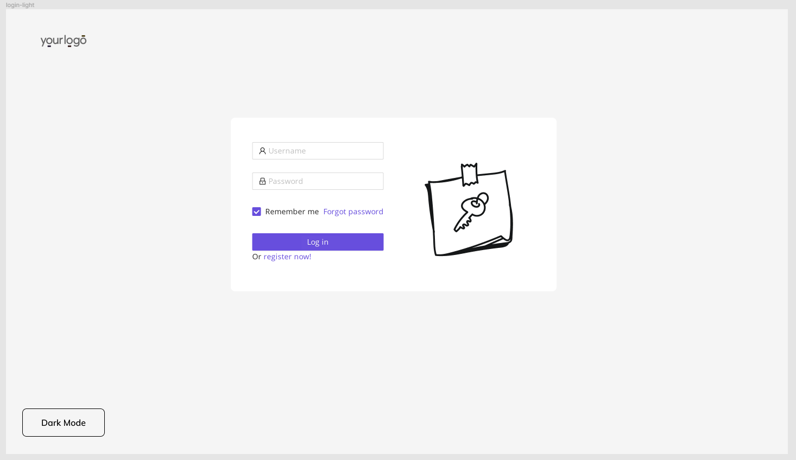    | 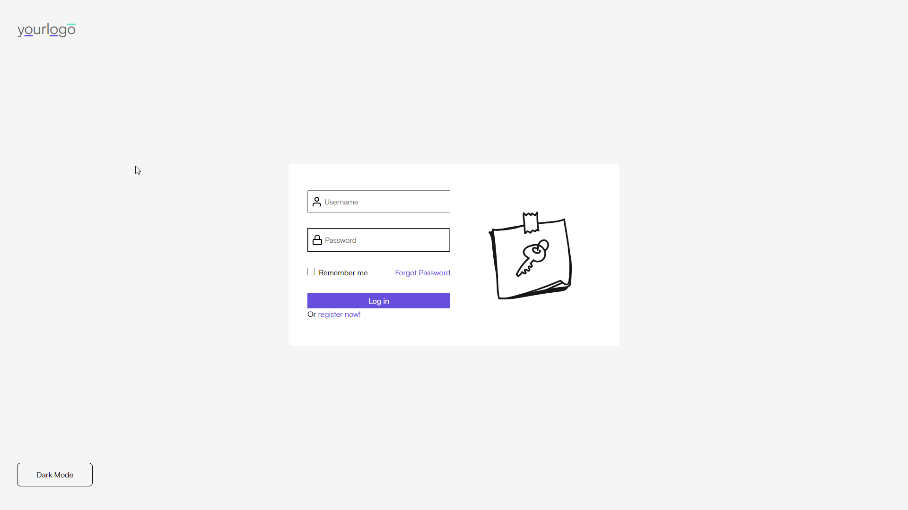    |

## Part Two: Responsive Mobile

| Figma Design                                                                  | React Implementation                                                                                       |
| ----------------------------------------------------------------------------- | ---------------------------------------------------------------------------------------------------------- |
| 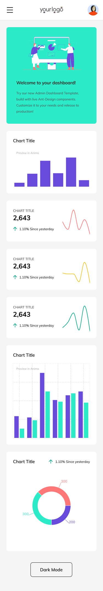 | 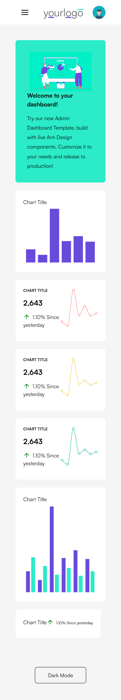 |
| 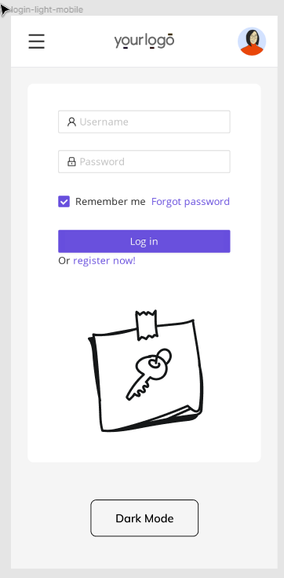    | 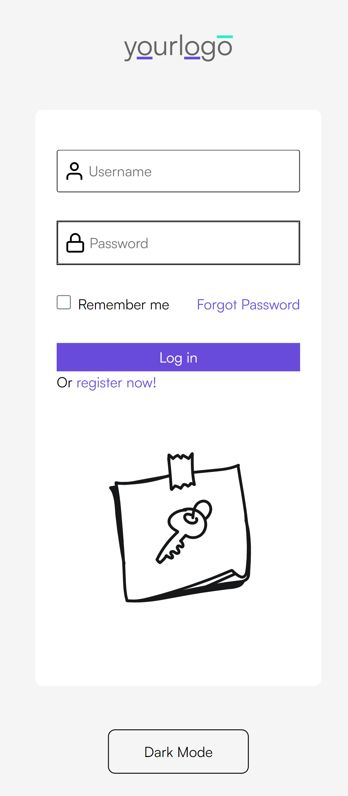                               |
| 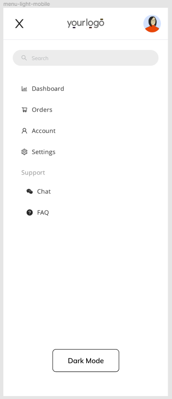           | 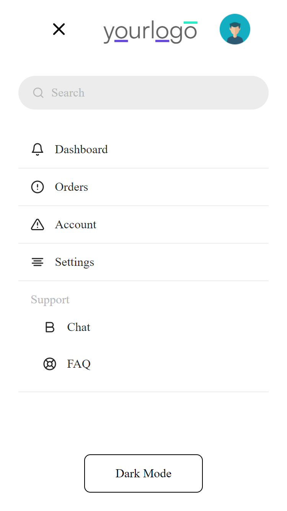                                      |

## Part Three: Dark Mode

| Figma Design                                                                   | React Implementation                                                             |
| ------------------------------------------------------------------------------ | -------------------------------------------------------------------------------- |
| 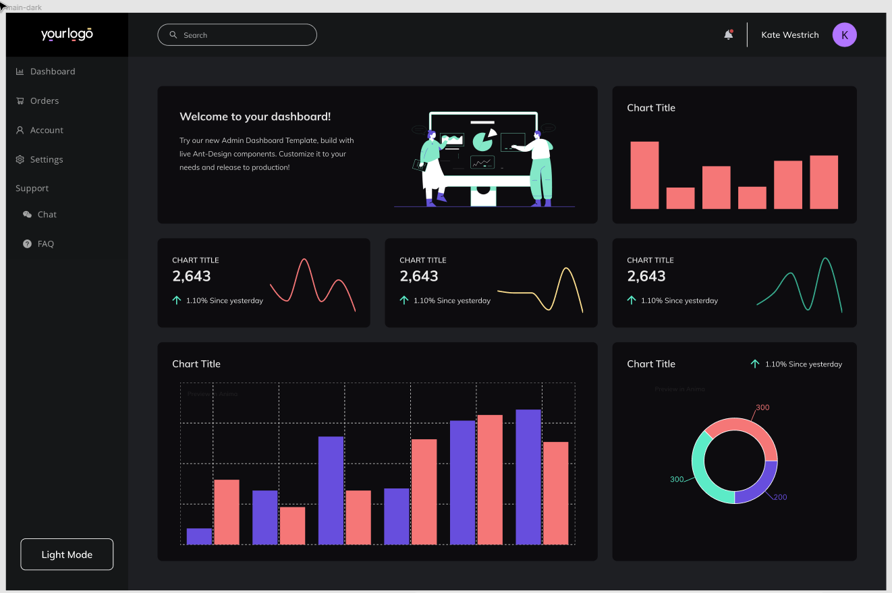 | 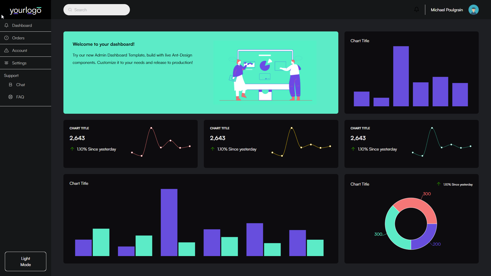 |
| 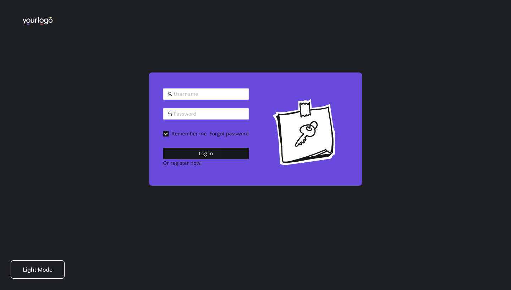    | 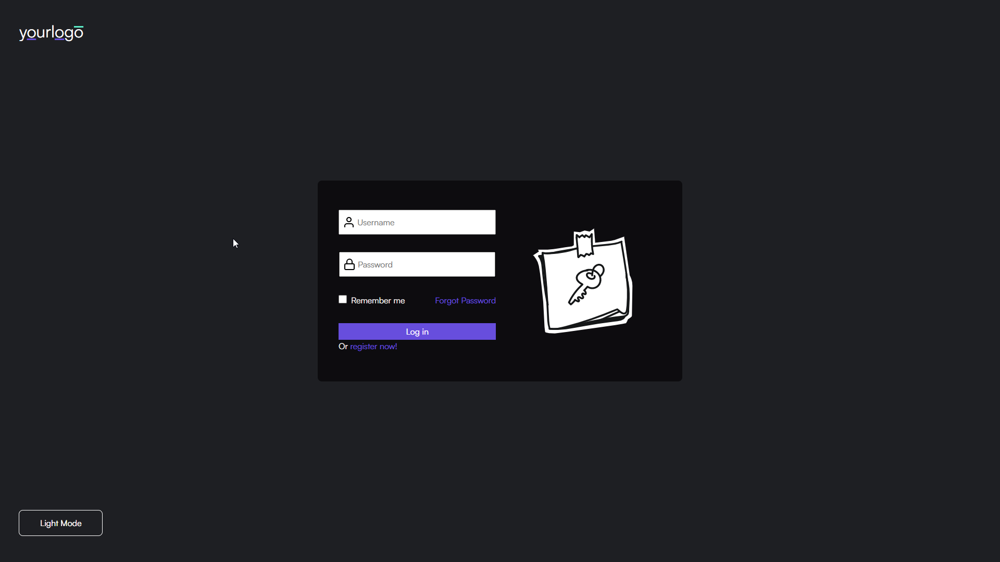    |
