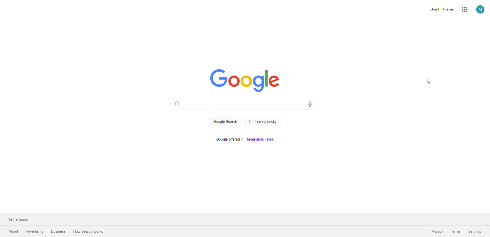
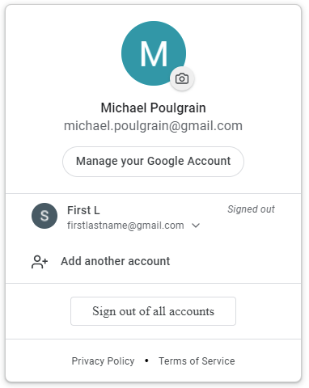
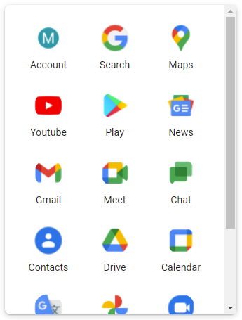
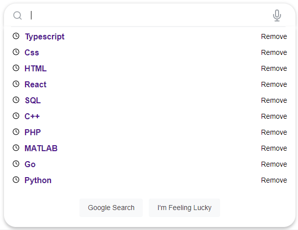

# Front-end practice: Google Clone

This is a clone of the google.com website built for practising front-end web development, in particular ReactJs and CSS.

Only Desktop implemented.

It has been deployed serverless via AWS.

The project uses Vite as a development server. To demo it, clone the repo, and run the following terminal commands from the fontend/app folder:

- `npm install`
- `npm run start`

Stack used:

- Typescript
- Figma
- Vite
- React V18
- Reach UI
- Styled Components

Finished Product can be viewed here: https://d1rb78tki035w5.cloudfront.net/

Figma Design : https://www.figma.com/file/5rwkfdsREC2qk9tOFaAvQU/Google?node-id=0%3A1

